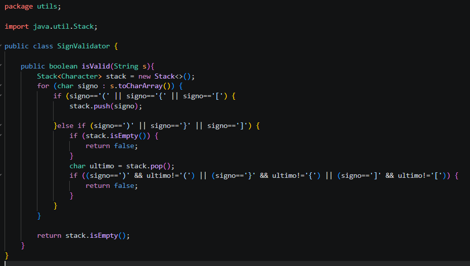
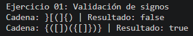
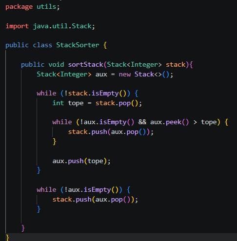
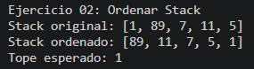
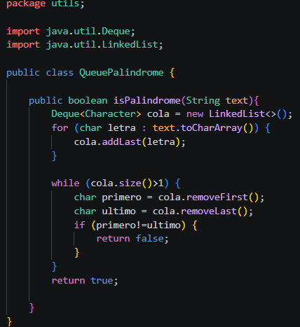
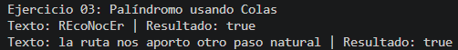
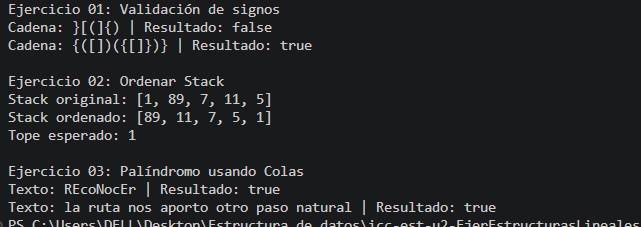

# Practica: Dinamicas Lineales en Java

## Datos del Estudiante
- **Nombre:** Daniel Ernesto Flores Romero, Carlos Fernando Tello Bermeo, Ricardo Emilio Uzhca Benavides
- **Curso:** Grupo 1
- **Fecha:** 12/06/02026

- **URL del release: 2.0.2:** 

---

**Descripcion General:**
Este proyecto contiene el desarrollo de ejercicios prácticos enfocados en el uso de estructuras de datos lineales en Java, específicamente pilas (Stack) y colas (Queue). A través de estos ejercicios se aplican algoritmos que permiten resolver problemas clásicos como la validación de signos, el ordenamiento de datos y la verificación de palíndromos.

---

**Ejercicio 1**

**Descripcion:**

Validación de signos usando Stack

En este ejercicio se implementa un algoritmo que permite verificar si una cadena de texto que contiene símbolos como paréntesis, llaves y corchetes está correctamente balanceada. Se utiliza una pila para almacenar los símbolos de apertura y verificar que cada símbolo de cierre corresponda al tipo correcto y en el orden adecuado.

Salida de consola:

---

**Ejercicio 2**

**Descripcion:**

Ordenamiento de un Stack

Se desarrolla un algoritmo que permite ordenar una pila de números enteros utilizando únicamente pilas adicionales. El objetivo es que el menor elemento quede en el tope de la pila. Para lograr esto, se manipulan los elementos utilizando operaciones propias del Stack como push, pop y peek, sin utilizar arreglos u otras estructuras.

Salida de consola:

---

**Ejercicio 3**

**Descripcion:**

Validación de palíndromo usando Queue

En este ejercicio se implementa un método que determina si una palabra es palíndroma utilizando colas. Se aprovecha el comportamiento FIFO (First In, First Out) de las colas para comparar los caracteres en el orden correcto sin recurrir a comparaciones directas del string original con su versión invertida.

Salida de consola:

---

**Salidas consola: Ejercicio 1, 2 y 3**

